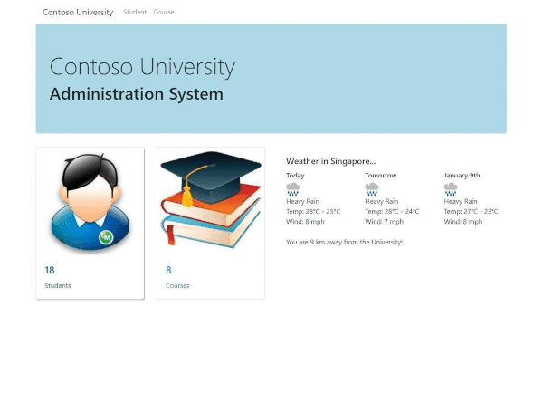

# ContosoUniWebAPI

This is the a project for PROGRAMMING IN HTML5 WITH JAVASCRIPT AND CSS3

## Tech/framework used

* Visual Studio 2019 Community Edition
* SQL Server 2019 Developer Edition
* Bootstrap 4
  * Model
  * Table + Pagination
* Jquery 
  * sending Ajax API request
* ASP.Net Core Web API - as JSON service provider
  * Models
  * Controllers

## Databse Diagram

## Demo

## License

This project is licensed under the MIT License - see the [LICENSE.md](LICENSE.md) file for details

