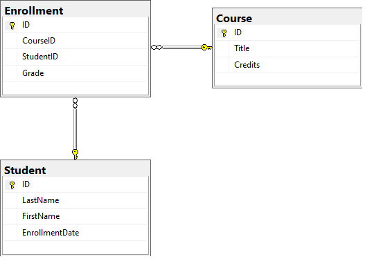

# ContosoUniWebAPI

This is the a project for PROGRAMMING IN HTML5 WITH JAVASCRIPT AND CSS3

## Tech/framework used

* Visual Studio 2019 Community Edition
* SQL Server 2019 Developer Edition
* Bootstrap 4
  * Model
  * Table + Pagination
* Jquery 
  * sending Ajax API requests
* ASP.Net Core Web API - as JSON service provider
  * Models
  * Controllers

## API Call from browser

* http://localhost/api/Students - GET all student records
* http://localhost/api/Students/1 - GET single student record together with this student enrollment records
* http://localhost/api/Courses - GET all course records
* GET, POST, PUT, DELETE implemented by Ajax in web application

## Database Diagram

## Demo
https://contosouniwebapi.azurewebsites.net/index.html

## License

This project is licensed under the MIT License - see the [LICENSE.md](LICENSE.md) file for details

